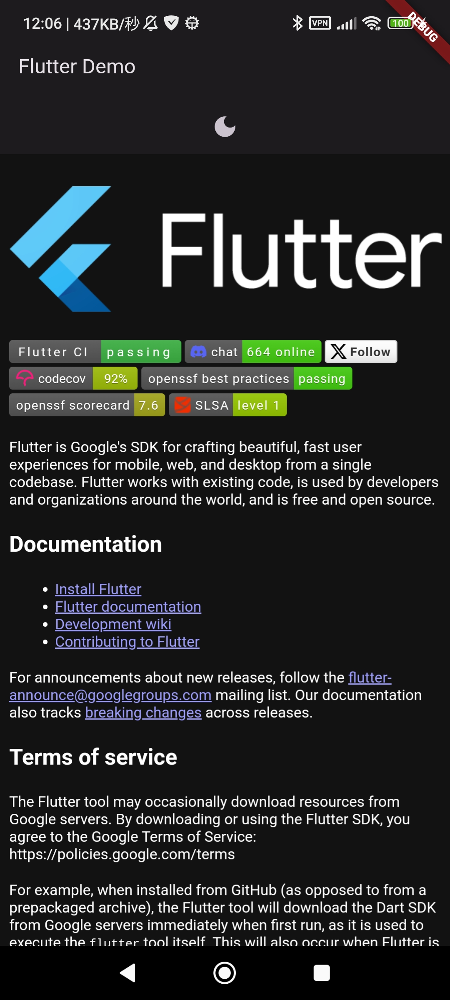

# flutter_github_markdown

Flutter implementation of [github-markdown-css](https://github.com/sindresorhus/github-markdown-css)

Note that we are using WebView




## introduction

```yaml
  flutter_github_markdown:
    git:
      url: https://github.com/fa0311/flutter_github_markdown.git
```